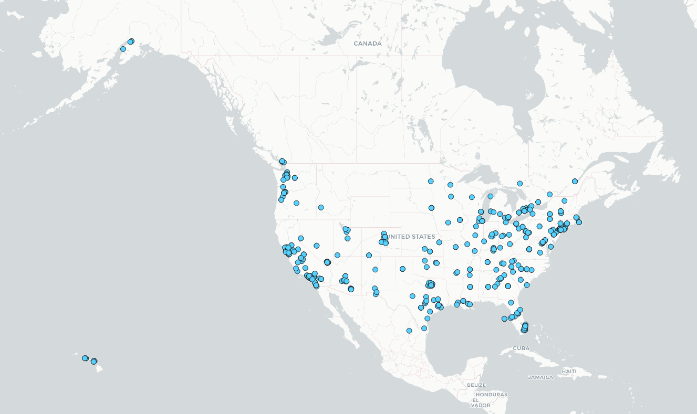
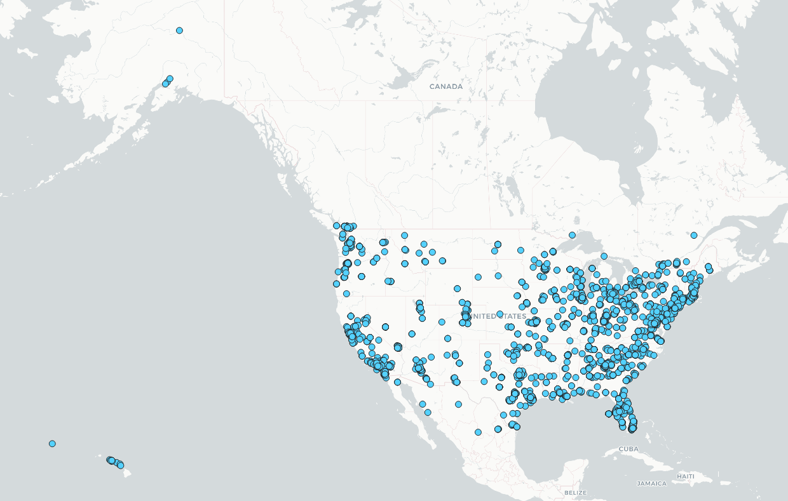

# geog458_lab2

## Introduction
I wanted to compare tweets in the United States at two different times of day to see if the 
themes of content that people post differs. I was hoping that during standard business hours
there would be tweets associated with work/formal topics and in the middle of the night there
would be more tweets associated with gaming/partying/etc.

## Maps

The first map shows the locations of geotagged tweets gathered at 1am (Pacific Time). The second
map shows the locations of geotagged tweets gathered at noon (Pacific Time).
I kept the symbology the same across both maps so any differences would be easier to spot and
not misconstrued as a symbol change. We can see far more points in the second map, showing that more 
people are active on Twitter in the afternoon than in the middle of the night. The majority of new
points are gathered in the Eastern contiguous United States which makes sense considering far fewer
people are likely to be awake at 4am vs 1am.

## Word Clouds

A word cloud is a collection of the most commmon words used with the biggest words having the
greatest count and the smallest words having the least count. The first word cloud, purposely depicted
in the shape of a bird like the Twitter logo, shows the most common words gathered from all geotagged
tweets in the United States at 1am (Pacific Time). The second word cloud shows the most common words
at noon (Pacific Time). The word clouds don't contain common words or numbers to ensure we only get
meaningful words. Unfortunately, we still end up with some words that don't make sense in English like
"Ita", "Dy", and "Co" - which also happen to be some of the most common text in both sets of tweets.
Aside from that, there is actually a slight difference between the sets, although not as big as I 
expected. "Job", "Work" and "Hire" are fairly common terms in the second word cloud and I can only find
"Work" (albeit in a smaller size) in the first word cloud. On the flip side, "Time", "Life", and "Fuck"
are common in the first word cloud and non-existent in the second one. There's a difference in priorities based on the time of day the tweets are posted. People are focused on professional duties during the day and allow themselves to be more retrospective at night.